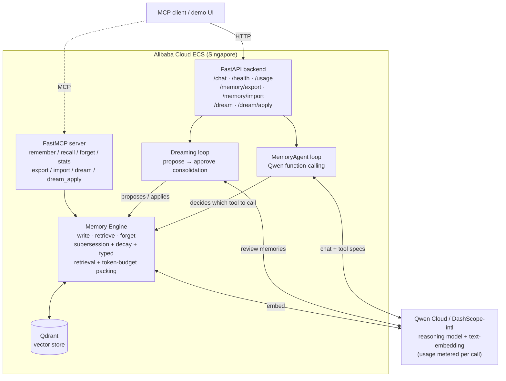
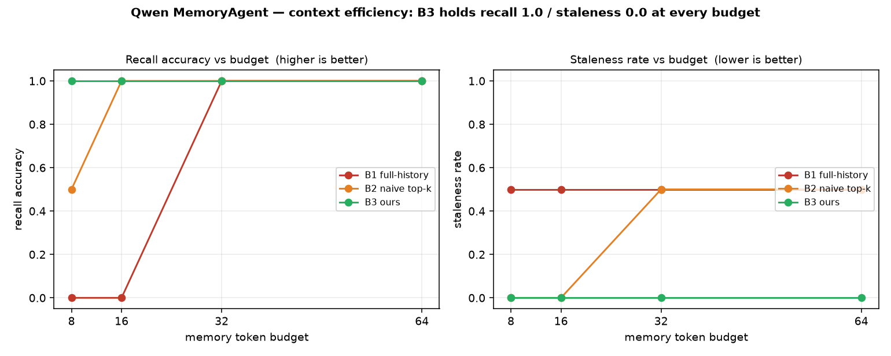

# qwen-memory-agent

A **benchmarked, MCP-native persistent-memory agent** built on **Qwen Cloud** (Alibaba Cloud / DashScope). Submitted to the Qwen Cloud Hackathon, **Track 1 — MemoryAgent**.

The agent *itself* decides — via Qwen function-calling — when to remember, recall, or forget. It carries user preferences across sessions, **forgets superseded facts**, and recalls the right memories inside a **tight token budget** — and proves it with numbers against naive baselines.

## Why it's different

Most memory agents are "stuff everything into RAG and hope." This one treats memory as a
measurable engineering problem, and every capability maps to a Track-1 requirement:

- **Agentic memory via Qwen function-calling** — the model invokes `remember` / `recall` / `forget` tools through a real agent loop. It's an agent *with* memory, not a database with an LLM bolted on.
- **Supersession-aware forgetting** — when a new fact contradicts an old one of the same subject/kind, the old record is retired (not just buried under recency), so recall stops surfacing the stale value.
- **Graded, time-based decay + reinforce-on-recall** — `effective_salience = salience · 0.5^(age / half_life)` (per-type half-lives; `preference` pinned). Recalling a memory refreshes it (`access_count`, `last_accessed`), so hot memories stay and cold ones fade — *"timely forgetting of outdated information."*
- **Typed retrieval — a second self-correcting layer** — a type-aware ranking prior (a durable `preference` outranks a throwaway `episodic` note of equal cosine) *plus* a retrieval-time "one-active-per-`(subject, type)`, keep-newest" veto that catches stale contradictions the write path can miss (e.g. records that arrive via import). *"Recall the most critical memories under limited context."*
- **Budget-constrained recall** — retrieval scores memories by `α·cosine + β·recency + γ·effective_salience + δ·type_prior` and greedily packs them until a configurable token budget is hit, so context stays small *and* relevant.
- **Portable memory (export / import)** — the whole store round-trips as JSON (vectors preserved, no re-embedding) or renders to Markdown, so memory moves *across sessions and machines.*
- **The dreaming loop (propose → approve)** — an offline Qwen pass reviews the store and *proposes* consolidations (merge / forget / re-salience); a human approves, then only approved proposals are applied. It validates every proposal against live record ids, so it refuses to act on its own hallucinations. *"Autonomously accumulate experience"* — with a human in the loop.
- **Token & model observability** — every Qwen call's `usage` (prompt / completion / total tokens, per model) is accumulated and exposed at `/usage`; `/chat` reports the per-request token delta.
- **A reproducible benchmark** — synthetic multi-session personas, a held-out query set, and baselines (no-memory / full-history / naive-RAG / ours), scored on recall accuracy, **staleness rate**, and a **context-efficiency curve**.

## Architecture



The agent loop (`/chat`) lets Qwen choose tool calls; the same memory engine is also exposed directly over MCP for any MCP client, and the dreaming loop drives it as a maintenance pass. The Qwen client has bounded retry/backoff for resilience and meters token usage on every call.

## HTTP + MCP surface

| HTTP route | MCP tool(s) | Purpose |
|---|---|---|
| `POST /chat` | `memory.remember` / `recall` / `forget` | agent loop; Qwen picks memory tools |
| `GET /usage` | — | accumulated token usage (per model) |
| `GET /memory/export` · `POST /memory/import` | `memory.export` / `memory.import` | round-trip the store (JSON + Markdown) |
| `POST /dream` · `POST /dream/apply` | `memory.dream` / `memory.dream_apply` | propose consolidations, then apply approved ones |
| `GET /health` | `memory.stats` | liveness / store counts |

## Stack

Python · FastAPI · **Qwen function-calling agent loop** · FastMCP · `openai` SDK → DashScope-intl · Qwen text-embedding · Qdrant · `tiktoken` (budget accounting).

## Quickstart

```bash
uv sync
cp .env.example .env   # set DASHSCOPE_API_KEY + DASHSCOPE_BASE_URL
uv run pytest -q       # tests run fully mocked — zero Qwen credit spend
```

## Benchmark results

Reproducible and **fully offline** — `uv run python -m benchmark.run` uses a deterministic
bag-of-vocabulary embedder, so the harness measures the *memory engine's* ranking +
supersession logic (not embedding noise) and costs **zero Qwen credits**. All three systems
compete under the **same shrinking token budget**, so this is a fair context-efficiency test.



Recall accuracy and staleness rate (fraction of answers containing a *retired* fact; lower is
better) vs the memory token budget, over the synthetic multi-session persona set in
`benchmark/generate.py`:

| Budget (tokens) | 8 | 16 | 32 | 64 |
|---|:--:|:--:|:--:|:--:|
| B1 full-history — recall / staleness | 0.00 / 0.50 | 0.00 / 0.50 | 1.00 / 0.50 | 1.00 / 0.50 |
| B2 naive top-k — recall / staleness | 0.50 / 0.00 | 1.00 / 0.00 | 1.00 / **0.50** | 1.00 / **0.50** |
| **B3 ours — recall / staleness** | **1.00 / 0.00** | **1.00 / 0.00** | **1.00 / 0.00** | **1.00 / 0.00** |

**B3 holds recall 1.00 and staleness 0.00 at every budget** — it's the only system that recalls
the current preference *and* never re-surfaces the retired one. Two things the naive baselines
can't do:

- **B1** (dump history chronologically) wastes its budget on the oldest facts, so it needs a
  large budget just to recall the current answer — and it permanently carries the stale one.
- **B2** (keyword top-k) *gets staler as the budget grows*: with no notion of "replaced," extra
  budget pulls the retired "coffee" fact back in, so its staleness climbs 0.00 → 0.50.

Only **supersession-aware forgetting + budget-constrained recall** keeps the working set both
correct and small.

## License

MIT — see [LICENSE](LICENSE).
