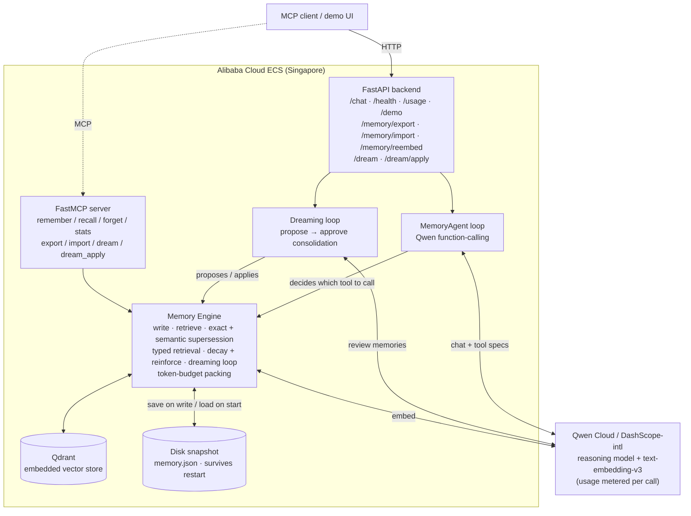
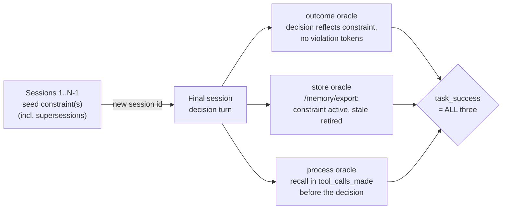
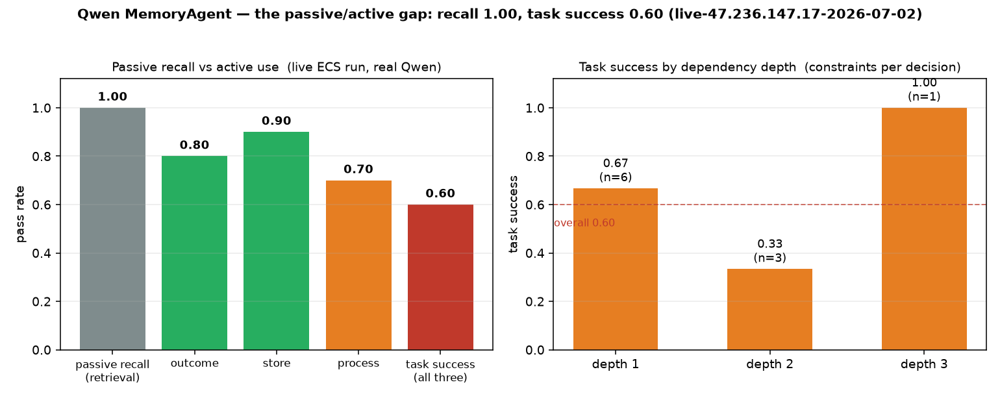

# qwen-memory-agent

A **benchmarked, MCP-native persistent-memory agent** built on **Qwen Cloud** (Alibaba Cloud / DashScope). Submitted to the Qwen Cloud Hackathon, **Track 1 — MemoryAgent**.

The agent *itself* decides — via Qwen function-calling — when to remember, recall, or forget. It carries user preferences across sessions, **forgets superseded facts**, and recalls the right memories inside a **tight token budget** — and proves it with numbers against naive baselines.

**[▶ Watch the 3-minute demo](https://youtu.be/TOMjFJ4ayYg)** · [Devpost submission](https://devpost.com/software/qwen-memory-agent) · [Build write-up](https://rduffy.uk/writing/memory-as-a-measurable-engineering-problem/)

## Why it's different

Most memory agents are "stuff everything into RAG and hope." This one treats memory as a
measurable engineering problem, and every capability maps to a Track-1 requirement:

- **Agentic memory via Qwen function-calling** — the model invokes `remember` / `recall` / `forget` tools through a real agent loop. It's an agent *with* memory, not a database with an LLM bolted on.
- **Supersession-aware forgetting (exact *and* semantic)** — when a new fact contradicts an old one, the old record is retired. Exact `(subject, type)` match handles the clean case; a **cosine-similarity** pass (configurable `SUPERSEDE_THRESHOLD`) also retires near-paraphrases the model filed under a *different* subject — the case that defeats exact matching in a real agent loop.
- **Semantic forget** — "forget my anime preferences" works even when the model can't guess the stored subject string: `forget(query=...)` embeds the description and deletes the closest matching memory above the threshold (the read-path twin of semantic supersession), with a recall→forget-by-id fallback when the first pass misses. Found by live conversational testing on the deployed box.
- **Graded, time-based decay + reinforce-on-recall** — `effective_salience = salience · 0.5^(age / half_life)` (per-type half-lives; `preference` pinned). Recalling a memory refreshes it (`access_count`, `last_accessed`), so hot memories stay and cold ones fade — *"timely forgetting of outdated information."*
- **Typed retrieval — a second self-correcting layer** — a type-aware ranking prior (a durable `preference` outranks a throwaway `episodic` note of equal cosine) *plus* a retrieval-time "one-active-per-`(subject, type)`, keep-newest" veto that catches stale contradictions the write path can miss (e.g. records that arrive via import). *"Recall the most critical memories under limited context."*
- **Budget-constrained recall** — retrieval scores memories by `α·cosine + β·recency + γ·effective_salience + δ·type_prior` and greedily packs them until a configurable token budget is hit, so context stays small *and* relevant.
- **Portable memory (export / import)** — the whole store round-trips as JSON or renders to Markdown. Vectors are preserved for the same embedder; if you swap embedders, mismatched records are detected and hidden until the explicit `POST /memory/reembed` maintenance pass spends credits to heal them.
- **Persistent across restarts** — set `MEMORY_PERSIST_PATH` and the store writes an atomic JSON snapshot on every change and reloads it on startup (rebuilding the vector index), so memories **survive a full server restart** — real persistence, not process-lifetime state.
- **The dreaming loop (propose → approve)** — an out-of-band Qwen pass reviews the store and *proposes* consolidations (merge / forget / re-salience); a human approves, then only approved proposals are applied. It validates every proposal against live record ids, so it refuses to act on its own hallucinations. *"Autonomously accumulate experience"* — with a human in the loop.
- **Model provenance** — each memory can carry both the chat model that wrote it (`source_model`) and the embedding model that produced its vector (`embed_model`), and export/import preserves those fields. Cryptographic signing is a future extension, not claimed here.
- **Token & model observability** — every Qwen call's `usage` (prompt / completion / total tokens, per model) is accumulated and exposed at `/usage`; `/chat` reports the per-request token delta.
- **A reproducible benchmark** — synthetic multi-session personas, a held-out query set, and baselines (no-memory / full-history / naive-RAG / ours), scored on context recall (retrieval-level, model-free), **staleness rate**, and a **context-efficiency curve**.
- **A live memory inspector at `/demo`** — a zero-dependency single-file UI: chat on the left, the live store on the right. You *watch* a contradicted fact strike through to `superseded` in real time, and drive the dreaming loop's propose → approve → apply.
- **Fuzzed against its own store** — 50 live conversational scenarios (casual corrections, forget phrasings, update chains, abstention, honesty edges) graded against **store state, not the model's prose**; findings + known limitations in [`docs/qa/conversational-fuzz-findings.md`](docs/qa/conversational-fuzz-findings.md), harness in [`scripts/conversational_fuzz.py`](scripts/conversational_fuzz.py).

## Architecture



The agent loop (`/chat`) lets Qwen choose tool calls; the same memory engine is also exposed directly over MCP for any MCP client, and the dreaming loop drives it as a maintenance pass. With `MEMORY_PERSIST_PATH` set, the engine snapshots to disk on every change and rehydrates on startup, so the store survives a restart. The Qwen client has bounded retry/backoff for resilience and meters token usage on every call.

## HTTP + MCP surface

| HTTP route | MCP tool(s) | Purpose |
|---|---|---|
| `POST /chat` | `memory.remember` / `recall` / `forget` | agent loop; Qwen picks memory tools |
| `GET /usage` | — | accumulated token usage (per model) |
| `GET /memory/export` · `POST /memory/import` | `memory.export` / `memory.import` | round-trip the store (JSON + Markdown) |
| `POST /memory/reembed` | — | explicit credit-spending repair after an embedding-model swap |
| `POST /dream` · `POST /dream/apply` | `memory.dream` / `memory.dream_apply` | propose consolidations, then apply approved ones |
| `GET /health` | `memory.stats` | liveness / store counts, including embed-model mismatches |
| `GET /demo` | — | live memory inspector (chat + store table + dreaming loop UI) |

## Stack

Python · FastAPI · **Qwen function-calling agent loop** · FastMCP · `openai` SDK → DashScope-intl · Qwen `text-embedding-v3` · Qdrant · `tiktoken` (budget accounting).

## Quickstart

```bash
uv sync
cp .env.example .env   # set DASHSCOPE_API_KEY + DASHSCOPE_BASE_URL
PYTHONPATH=src uv run --no-sync pytest -q tests/  # fully mocked — zero Qwen credit spend

# run the backend, then open the live memory inspector:
uv run uvicorn memory_agent.api:app --port 8000
open http://localhost:8000/demo
```

## Benchmark results

Reproducible and **fully offline** — `PYTHONPATH=src uv run --no-sync python -m benchmark.run` uses a deterministic
bag-of-vocabulary embedder, so the harness measures the *memory engine's* ranking +
supersession logic (not embedding noise) and costs **zero Qwen credits**. All three systems
compete under the **same shrinking token budget**, so this is a fair context-efficiency test.


Context recall (retrieval-level, model-free) and staleness rate (fraction of retrieved contexts
containing a *retired* fact; lower is better) vs the memory token budget, over the six-persona,
24-query synthetic set in `benchmark/generate.py`. Token budgets use `tiktoken`'s
`gpt-4o-mini` encoding as a consistent approximation for Qwen context accounting.

| Budget (tokens) | 8 | 16 | 32 | 64 |
|---|:--:|:--:|:--:|:--:|
| B1 full-history — context recall / staleness | 0.000 / 0.250 | 0.375 / 0.250 | 0.958 / 0.250 | 1.000 / 0.250 |
| B2 naive top-k — context recall / staleness | 0.875 / 0.125 | 1.000 / 0.250 | 1.000 / 0.250 | 1.000 / 0.250 |
| **B3 ours — context recall / staleness** | **1.000 / 0.000** | **1.000 / 0.000** | **1.000 / 0.000** | **1.000 / 0.000** |

**B3 holds context recall 1.000 and staleness 0.000 at every budget** — it's the only system
that recalls the current facts *and* never re-surfaces retired ones. Two things the naive
baselines can't do:

- **B1** (dump history chronologically) wastes its budget on the oldest facts, so it needs a
  large budget just to recall the current answer — and it permanently carries the stale one.
- **B2** (keyword top-k) *gets staler as the budget grows*: with no notion of "replaced," extra
  budget pulls retired facts back in, so its staleness climbs 0.125 → 0.250 and then plateaus.

Only **supersession-aware forgetting + budget-constrained recall** keeps the working set both
correct and small.

The semantic supersession threshold is also checked against live DashScope `text-embedding-v3`
embeddings in `docs/embedding-validation.md`. That run did **not** produce a perfect validation:
supersession-pair cosines were 0.879-0.908, while unrelated distractors were 0.683-0.743. The
default `SUPERSEDE_THRESHOLD=0.9` is therefore conservative and should be revisited with a larger
set rather than treated as a proven universal constant.

### Active-use eval — does the agent *use* memory, or just recall it?

Passive recall benchmarks saturate (see the 1.000s above) while the same systems fail when a
memory from one session must gate a *decision* in a later one — MemoryArena
([arXiv 2602.16313](https://arxiv.org/abs/2602.16313)) reports 40-60% task success for agents
that ace LoCoMo. [`benchmark/active_use.py`](benchmark/active_use.py) tests exactly that: 10
multi-session scenarios (constraint seeded in one session, decision demanded in a later one,
including superseded-constraint chains), each graded by **three independent oracles** — decision
outcome, store state via `/memory/export`, and recall-before-decision in the tool-call trace, so
a lucky guess without consulting memory scores zero.





**Live result on the deployed agent (real Qwen, fresh store): task_success 0.60** — outcome 0.80
· store 0.90 · process 0.70, `benchmark/results/active_use.json`. Our agent lands inside
MemoryArena's predicted band, and the eval caught three real defects the retrieval benchmark
structurally cannot see (decision turns skipping recall; a generic-subject collision where an
unrelated fact retired a dietary constraint; a missed cross-subject supersession). Full triage,
including the harness's own graded false-positives from run 1:
[`docs/qa/active-use-findings.md`](docs/qa/active-use-findings.md). We publish the 0.60 rather
than tuning the scenarios until it flatters — the gap between 1.000 recall and 0.60 active use
*is* the finding.

## How this maps to 2026 memory research

- **Forgetting as a first-class metric** — our staleness rate measures what the Memora benchmark
  ([arXiv 2604.20006](https://arxiv.org/abs/2604.20006)) later named *forgetting-aware accuracy*.
- **Memory as an auditable artifact** — the fuzz + active-use oracles grade the store, never the
  model's prose, the evaluation stance of MEMPROBE
  ([arXiv 2606.24595](https://arxiv.org/abs/2606.24595)); our honesty rule (an answer implying
  "done" must match the store) is stricter than prose-grading.
- **Honest baselines under a token budget** — EvoMemBench
  ([arXiv 2605.18421](https://arxiv.org/abs/2605.18421)) shows long-context baselines beat most
  memory systems on raw accuracy; memory wins on *accuracy at a budget*. Our context-efficiency
  curve runs all baselines under identical token accounting for that reason.
- **Active use over passive recall** — the active-use eval above adopts the MemoryArena
  ([arXiv 2602.16313](https://arxiv.org/abs/2602.16313)) framing.
- **Admission control, deliberately inverted** — A-MAC
  ([arXiv 2603.04549](https://arxiv.org/abs/2603.04549)) gates memories at write time and
  discards rejects. We accept-then-retire instead: superseded records stay queryable
  (`history()`, temporal queries), because rejected memories are unauditable — the property
  post-hoc audit work like MemAudit ([arXiv 2605.23723](https://arxiv.org/abs/2605.23723))
  depends on.

## Future work

- **Memory governance** — designed in
  [`docs/design/memory-governance.md`](docs/design/memory-governance.md): domain-scoped writes +
  scoped retrieval, with the existing dreaming loop as the gated cross-domain promotion
  mechanism (propose → human approve → apply) — the primitives of governed shared memory
  ([arXiv 2606.24535](https://arxiv.org/abs/2606.24535),
  [Collaborative Memory, arXiv 2505.18279](https://arxiv.org/abs/2505.18279)). Threat model:
  one poisoned observation persists cross-session (eTAMP,
  [arXiv 2604.02623](https://arxiv.org/abs/2604.02623)); quarantine-by-domain caps the blast
  radius, and the provenance we already stamp enables the audit. Two of the four primitives
  (temporal supersession, provenance) are already shipped.
- **Supersession repair** (from the active-use findings): require a cosine floor before
  exact-subject supersession acts (stops generic-subject collisions), and route the 0.7-0.9
  cosine band to the dreaming loop for human-approved consolidation instead of silent action.
- **Temporal knowledge graph** for bi-temporal facts (Zep,
  [arXiv 2501.13956](https://arxiv.org/abs/2501.13956)); **SLM-staged retrieval** for latency
  (LightMem, [arXiv 2604.07798](https://arxiv.org/abs/2604.07798)); **trained memory policies**
  (MemTrain, [arXiv 2606.03197](https://arxiv.org/abs/2606.03197)).

## License

MIT — see [LICENSE](LICENSE).
