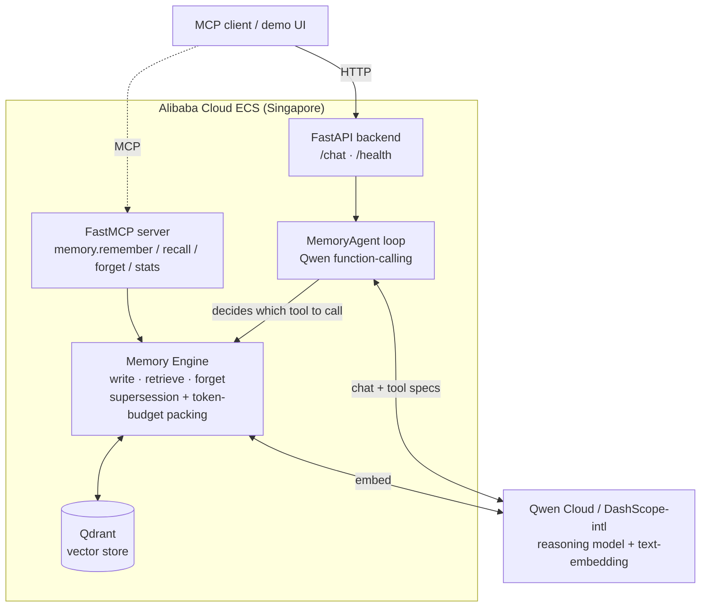

# qwen-memory-agent

A **benchmarked, MCP-native persistent-memory agent** built on **Qwen Cloud** (Alibaba Cloud / DashScope). Submitted to the Qwen Cloud Hackathon, **Track 1 — MemoryAgent**.

The agent *itself* decides — via Qwen function-calling — when to remember, recall, or forget. It carries user preferences across sessions, **forgets superseded facts**, and recalls the right memories inside a **tight token budget** — and proves it with numbers against naive baselines.

## Why it's different

Most memory agents are "stuff everything into RAG and hope." This one adds:

- **Agentic memory via Qwen function-calling** — the model invokes `remember` / `recall` / `forget` tools through a real agent loop. It's an agent *with* memory, not a database with an LLM bolted on.
- **Supersession-aware forgetting** — when a new fact contradicts an old one of the same kind, the old record is retired (not just buried under recency).
- **Budget-constrained recall** — retrieval greedily packs the most useful memories until a configurable token budget is hit, so context stays small *and* relevant.
- **A reproducible benchmark** — synthetic multi-session personas, a held-out query set, and baselines (no-memory / full-history / naive-RAG / ours), scored on recall accuracy, **staleness rate**, and a **context-efficiency curve**.

## Architecture



The agent loop (`/chat`) lets Qwen choose tool calls; the same memory engine is also exposed directly over MCP for any MCP client. The Qwen client has bounded retry/backoff for resilience.

## Stack

Python · FastAPI · **Qwen function-calling agent loop** · FastMCP · `openai` SDK → DashScope-intl · Qwen text-embedding · Qdrant.

## Quickstart

```bash
uv sync
cp .env.example .env   # set DASHSCOPE_API_KEY + DASHSCOPE_BASE_URL
uv run pytest -q       # tests run fully mocked — zero Qwen credit spend
```

## Benchmark results

Reproducible and **fully offline** — `uv run python -m benchmark.run` uses a deterministic
keyword embedder, so the harness measures the *memory engine's* ranking + supersession logic
(not embedding noise) and costs **zero Qwen credits**.

| System | Recall accuracy | Staleness rate |
|--------|:--------------:|:--------------:|
| B0 — no memory | 0.00 | 0.00 |
| B1 — full-history stuffing | 1.00 | 0.50 |
| B2 — naive top-k RAG | 1.00 | 0.50 |
| **B3 — ours (supersession + budget)** | **1.00** | **0.00** |

**B3 is the only system that recalls the current preference (1.00) _and_ never surfaces a
superseded one (0.00 staleness).** B1 and B2 match on recall but re-surface the retired
"coffee" preference on half the queries — because neither has a notion of "this fact was
replaced." Staleness = fraction of queries whose answer contained a retired fact (lower is
better), over the synthetic multi-session persona set in `benchmark/generate.py`.
Supersession-aware forgetting is what separates B3.

## License

MIT — see [LICENSE](LICENSE).
