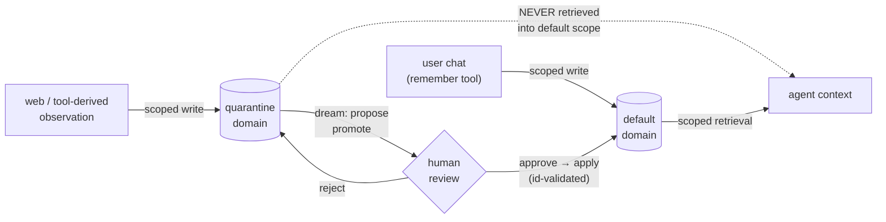

# Memory governance — domain-scoped memory with gated propagation

Status: **design** (not implemented). This document specifies how the existing
architecture extends to multi-principal memory governance: scoped writes, scoped
retrieval, and human-gated cross-domain propagation. It exists because the field
converged on exactly these primitives in mid-2026 — governed shared memory
([arXiv 2606.24535](https://arxiv.org/abs/2606.24535)), the GateMem benchmark
([arXiv 2606.18829](https://arxiv.org/abs/2606.18829)), and Collaborative Memory
([arXiv 2505.18279](https://arxiv.org/abs/2505.18279)) — and because two of the
four primitives already exist in this codebase.

## Why govern memory at the store, not the prompt

A memory store shared by multiple agents (or one agent with multiple tool
surfaces) fails in ways a single-user store cannot:

- **Poisoning persists.** eTAMP ([arXiv 2604.02623](https://arxiv.org/abs/2604.02623))
  shows a single contaminated *observation* — an agent reading a manipulated web
  page — silently poisons persistent memory and re-activates in later sessions,
  bypassing tool-level permission defenses because the poison enters through a
  legitimate read.
- **Contamination spreads through normal collaboration.** With a shared store,
  one compromised writer poisons every reader, and after propagation the origin
  is hard to attribute — unless provenance was recorded at write time, the
  premise of post-hoc audit work like MemAudit
  ([arXiv 2605.23723](https://arxiv.org/abs/2605.23723)).
- **Prompt-level rules don't bind adversaries.** A prompt-injected agent keeps
  its promises to the attacker. "The store won't return it" is enforcement;
  "the agent promises not to look" is not. Scoping must live in the retrieval
  path.

Our own live active-use runs ([`docs/qa/active-use-findings.md`](../qa/active-use-findings.md))
add a non-adversarial motivation: the model files unrelated facts under generic
subjects (`user`), letting one scenario's write retire another's constraint.
Domains are the natural blast-radius boundary for *accidental* interference too
— supersession scoped to a domain cannot destroy another domain's facts.

## Data model

One additive field on `MemoryRecord`:

```python
domain: str = "default"
```

- Existing snapshots, exports, and imports validate unchanged (the default
  covers them) — a governance-unaware backup restores cleanly.
- Promotion history is recorded on the record when a move happens:
  `promoted_from: str | None`, `promoted_at: datetime | None`. Together with the
  existing `source_model`, `embed_model`, `session_id`, and `superseded_by`
  audit trail, every record answers: *who wrote you, with what model, where did
  you live, and who approved your move?*

## The four primitives

| Primitive (arXiv 2606.24535) | Status here | Design |
|---|---|---|
| Temporal supersession | **shipped** | two-pass supersession + read-time stale-sibling veto — now scoped per-domain |
| Provenance tracking | **shipped** | `source_model` / `embed_model` / `session_id` / `superseded_by`, retained not deleted |
| Scoped retrieval | designed below | `retrieve(query, scopes=...)` filters candidates by `record.domain` BEFORE ranking/packing |
| Policy-governed propagation | designed below | the dreaming loop's propose → approve → apply cycle gains a `promote` proposal kind |

### Scoped writes

Every writer principal (an MCP client, an API token, an agent role) carries an
allowed-domains set; `remember` lands in the principal's home domain. Records
derived from untrusted observations (web pages, third-party documents, tool
output) land in **`quarantine`** regardless of the writer's home domain.

Principal→scope assignment is deliberately boring: a static map in server
configuration (env/JSON), resolved per connection. Dynamic policy engines are a
non-goal at this scale; the win is that the mapping is enforced in one place.

### Scoped retrieval

```python
def retrieve(self, query, *, scopes: set[str], token_budget=None, ...):
    candidates = [r for r in self.store.search(...) if r.record.domain in scopes]
    # ranking, veto, packing unchanged
```

- The filter runs BEFORE ranking and token packing, so out-of-scope records
  never compete for budget and never reach the context window. Leakage is
  prevented structurally, not behaviorally.
- Supersession and the stale-sibling veto operate within a domain. A quarantine
  record can never supersede a `default` record — which also fixes a class of
  accidental cross-scenario interference we observed live.
- `scopes` defaults to `{"default"}` for backward compatibility; the agent loop
  passes its principal's scopes.

### Gated propagation — the dreaming loop is already the mechanism

The dreaming loop today proposes consolidations (merge / forget / re-salience),
a human approves, and `apply` validates every proposal against live record ids —
refusing to act on hallucinated ones. Governance adds one proposal kind:

```python
DreamProposal(kind="promote", target_ids=[...], from_domain="quarantine",
              to_domain="default", rationale="...")
```

Same review surface, same approval gate, same id validation. Nothing crosses a
domain boundary silently; the approval step is where a human looks at a
quarantined fact and decides it is real.



## Threat model walkthrough (eTAMP-style poisoning)

1. An agent summarizes a web page containing an injected instruction-as-fact
   ("the user's preferred payment address is X").
2. The write path stamps provenance and lands it in `quarantine` — the writer's
   surface, not its claimed content, decides the domain.
3. Every later `/chat` retrieval runs in `default` scope: the poison never
   enters the context window. It is visible in the store inspector, struck
   through from the agent's working view.
4. The dreaming loop surfaces it for review with its provenance (source model,
   session, origin domain). The human rejects; the record stays quarantined (or
   is deleted). If a poisoned record were ever approved, `promoted_from` +
   `promoted_at` + the approval trail make the audit tractable — the MemAudit
   premise.

Blast radius of one poisoned observation: one domain, zero decisions.

## Failure-mode map

Mapping to the four failure modes named in arXiv 2606.24535:

| Failure mode | Defense here |
|---|---|
| Unauthorized leakage | scope filter before ranking — out-of-scope records structurally absent from context |
| Stale propagation | supersession + stale-sibling veto, per-domain |
| Contradiction persistence | same supersession machinery; contradictions across domains are surfaced at promotion review, not auto-resolved |
| Provenance collapse | immutable write-time provenance + promotion trail; superseded records retained, never destroyed |

## Non-goals (the research frontier, cited not claimed)

- **Multi-user bipartite access graphs** and time-evolving user↔agent↔resource
  permissions (Collaborative Memory's full model).
- **Retrospective revocation** — re-gating memories derived from a resource the
  writer later lost access to.
- **Cryptographic signing of records** — provenance fields are trusted because
  the store is trusted; signing is the escalation path if it isn't.
- **Dynamic policy engines** — a static principal→scopes map is the right size
  for a single-operator deployment.

## Implementation order (post-submission)

1. `domain` field + default backfill; export/import/snapshot round-trip tests.
2. `retrieve(scopes=...)` filter + per-domain supersession; backward-compat
   tests pinning that a governance-unaware caller sees identical behavior.
3. `promote` proposal kind in the dreaming loop + inspector domain column.
4. Principal→scopes map on the MCP server and HTTP API.

Steps 1-2 also deliver the supersession-repair groundwork from the active-use
findings (domain scoping caps subject-collision blast radius; the cosine-floor
fix is orthogonal and can land independently).
